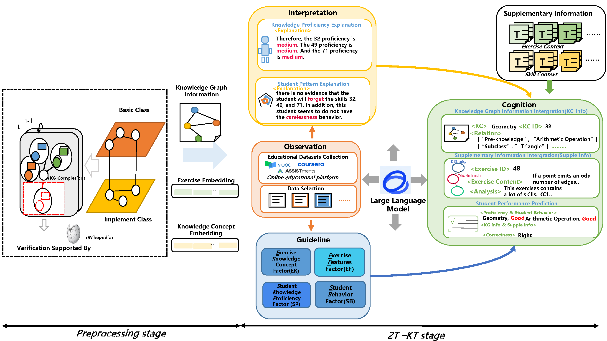

# 2T-KT-model
This a demo implementation code for our paper "Thinking As a Teacher: LLM Supporting Knowledge Tracing Leveraging Global Subject and Student Specific Knowledge Graphs"

# Model Architecture

